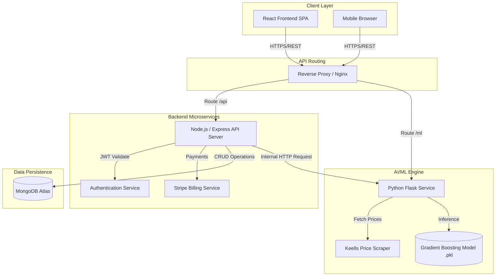
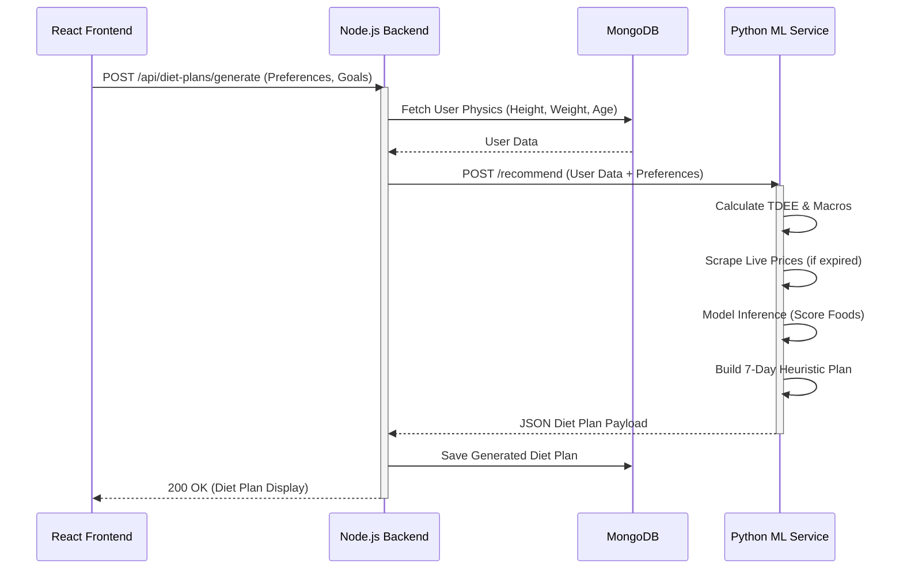

# SDFitness Platform - Architecture Diagrams

## System Architecture



## Data Flow Diagram (Diet Generation)



## Use Case Diagram (Core)

```mermaid
usecaseDiagram
    actor Member
    actor Admin
    actor Trainer

    %% Member Cases
    Member --> (Manage Profile & Health Metrics)
    Member --> (Generate AI Diet Plan)
    Member --> (Book Classes)
    Member --> (View Grocery List)

    %% Trainer Cases
    Trainer --> (Manage Availability)
    Trainer --> (View Assigned Classes)
    Trainer --> (Message Members)

    %% Admin Cases
    Admin --> (Manage Equipment Inventory)
    Admin --> (View Gym Analytics)
    Admin --> (Manage Subscriptions)
```
